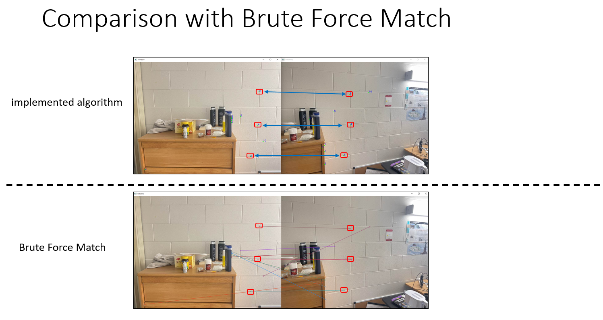

# MatchDescriptors

This Python script provides functions for finding matching keypoints between two images, marking them on the images, and then using the RANSAC algorithm to calculate the homography between the two images.

## Dependencies
The script requires the following dependencies:
- OpenCV (cv2)
- NumPy

## Functions
### `mark_matching_points(img1, img2, kp1, kp2, distance_min_list, length_kp)`
This function takes in two images (`img1` and `img2`), two lists of keypoints (`kp1` and `kp2`), a list of distances between keypoints (`distance_min_list`), and the length of the keypoints list (`length_kp`). It then marks the matching keypoints on the images using circles and numbers.

### `ransac(kp1_list, kp2_list, thresh)`
This function takes in two lists of keypoints (`kp1_list` and `kp2_list`) and a threshold value (`thresh`). It then uses the RANSAC algorithm to calculate the homography between the two images based on the matching keypoints. The function returns the final homography matrix.

### `geometricDistance(correspondence, h)`
This function takes in a correspondence pair (`correspondence`) and a homography matrix (`h`). It calculates the geometric distance between the estimated point and the actual point and returns the distance.

### `calculateHomography(correspondences)`
This function takes in a list of correspondence pairs (`correspondences`) and calculates the homography matrix using SVD decomposition. It then returns the homography matrix.

### Implementation Details:
1. randomly select 4 keypoints pairs 
2. calculate homography using 4 matched points
3. count inliers for calculated homography within threshold
4. repeat above processes 1,00 timesuntil it finds the most inliers  
5. return homography where it has the most inliers

